# Sentry集成

使用Docker安装sentry，使用release版本
https://github.com/getsentry/onpremise/releases
***
## docker安装 
***注意***:  
先安装docker服务  docker --version 验证是否安装成功  
docker镜像加速  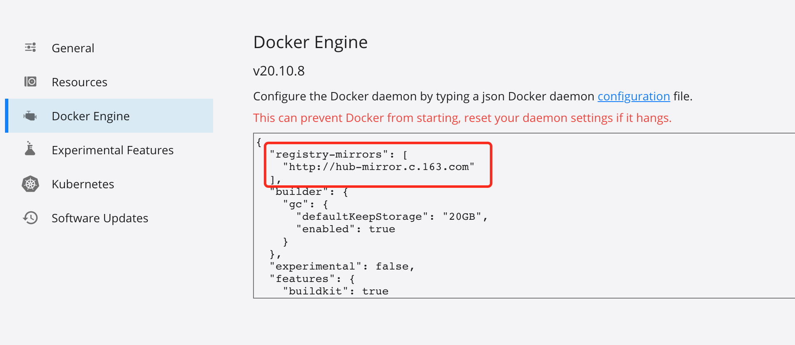 
***
## Sentry安装
下载：wget https://github.com/getsentry/onpremise/archive/refs/tags/21.8.0.zip  
解压：unzip 21.8.0.zip  
cd到解压后的文件夹，执行./install.sh

***注意***:  
在 Mac OS 执行 ./install.sh 遇到一些问题：
* 出错提示：realpath: command not found
原因：就是找不到 realpath 这个命令。
解决方法：需要安装coreutils。我用 brew，安装命令是： brew install coreutils
* 出错提示：FAIL: Required minimum RAM available to Docker is 3800 MB, found 1986 MB
原因：限制了 Docker 的内存使用。
解决方法：我用的是 docker.app，直接打开界面，设置里面 resource 的设置发现是 给 2GB内存给 Docker。修改为 大于 2GB即可。我设置了 5GB。

./install.sh 会把Sentry需要用到的各种容器的依赖，包括像Redis、Kafka、ClickHouse等不同的依赖的镜像，docker的Image镜像都下载下来，这样系统环境准备好了

添加账户：  
docker-compose run --rm web createuser --superuser --force-update  
superuser 表示创建管理员。  
force-update 表示覆盖存在的用户。
***
## 启动服务
docker-compose up -d  
启动完成之后，可以查看docker ps | less
***
## 访问
127.0.0.1:9000

1.创建Teams  
>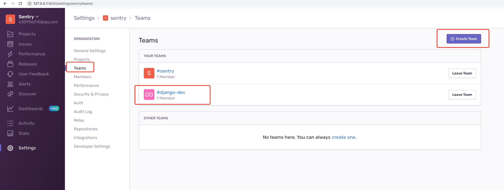 
2.创建Projects(propular为Django)
>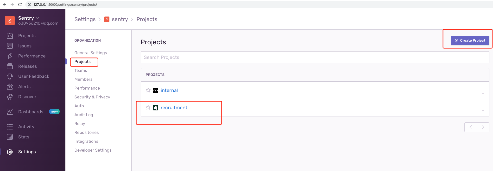 

创建完成之后，会有引导如何在Django中配置  
>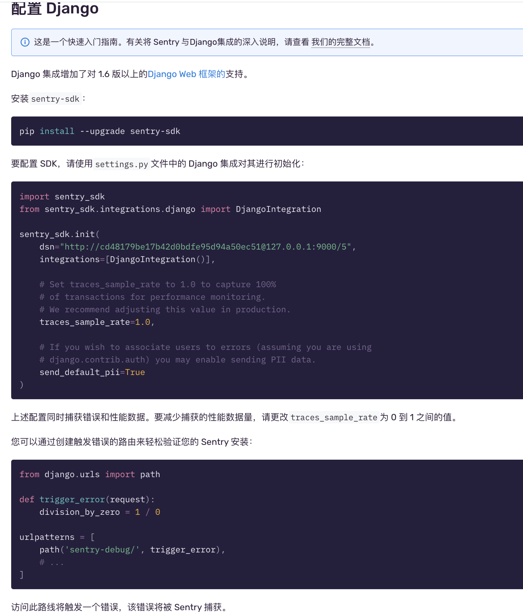 

***注意***：  
sentry下载的21.8.0的版本，使用的21.10.0版本时，捕获不到异常
***
## 捕获异常
访问url:http://127.0.0.1:8000/sentry-debug/即可在sentry中捕获到异常  
项目中可以使用error级别日志，也可以捕获到异常  
>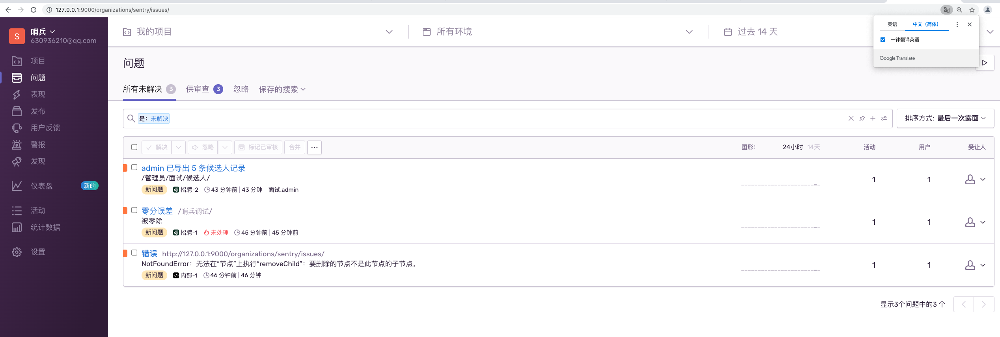 

### 通过类的方式实现性能记录跟异常捕获的中间件
当系统出现异常时，做两个事情：  
1.把这个异常通过capture_exception上报到Sentry  
2.异常发送钉钉群  


***
***
***
# XSS跨站脚本攻击
恶意攻击者将代码通过网站注入到其他用户浏览器中的攻击方式  
* 攻击者把恶意JavaScript代码作为普通数据放入到网站数据库中
* 其他用户在获取和展示数据的过程中，运行JavaScript代码
* JavaScript代码执行恶意代码（调用恶意请求，发送数据到攻击者等等）   

***示例***  
```python
'''
直接返回  HTML 内容的视图 （这段代码返回的页面有 XSS 漏洞，能够被攻击者利用）
'''
def detail_resume(request, resume_id):
    try:
        resume = Resume.objects.get(pk=resume_id)
        content = "name: %s <br>  introduction: %s <br>" % (resume.username, resume.candidate_introduction)
        return HttpResponse(content)
    except Resume.DoesNotExist:
        raise Http404("resume does not exist")
# 添加url
if settings.DEBUG : # 生产环境不让访问
    # 有 XSS 漏洞的视图页面，
    urlpatterns += [url(r'^detail_resume/(?P<resume_id>\d+)/$', views.detail_resume, name='detail_resume'),]
``` 
某用户（恶意攻击者）申请职位时，在自我介绍中，输入JavaScript代码，然后提交  
```javascript
<script>alert('page cookies:\n' + document.cookie);</script>
```

这样其他用户再通过该url访问恶意攻击者的简历详情时，就会执行JavaScript代码。如下图所示  
>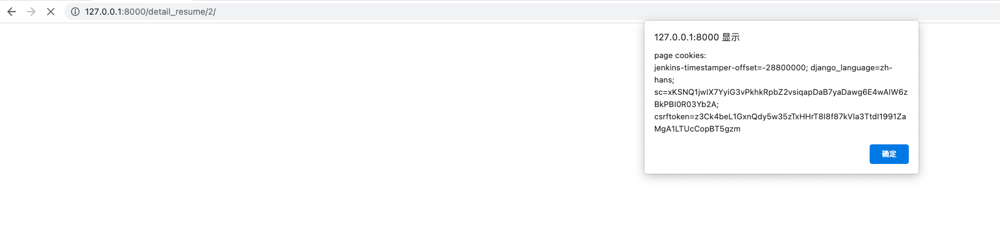
*** 
***如何防止?***  
这个视图函数与其他视图函数不同的地方，其他函数是通过render函数返回的，实际上这个模版渲染出来的时候，Django会自动把HTML的内容做转译，
所有的脚本都不会仔执行。所以这个函数自己返回html的时候，可以对它做一个转译。用html弱函数做转译，但是不建议。通常建议的做法是，直接使用系统自带的
render方法，用Django自带的模版的机制去渲染页面，这样能完全避免XSS的攻击（也可以使用通用视图，像简历详情一样）。  

简单点,使用html的escape方法进行转义：
```python
import html
def detail_resume(request, resume_id):
    try:
        resume = Resume.objects.get(pk=resume_id)
        content = "name: %s <br>  introduction: %s <br>" % (resume.username, resume.candidate_introduction)
        return HttpResponse(html.escape(content))
    except Resume.DoesNotExist:
        raise Http404("resume does not exist")
```
***
***
***
# CSRF跨站请求伪造
CSRF(Cross-site request forgery，简称：CSRF 或 XSRF）  
恶意攻击者在用户不知情的情况下，使用用户的身份来操作

黑客的准备步骤：  
* 黑客创建一个请求网站A类的URL的web页面，放在恶意网站B中，这个文件包含了以一个创建用户的名单。这个表单加载完毕就会立即提交
* 黑客把这个恶意web页面的url发送至超级管理员，诱导超级管理员打开这个web页面  

***演示***  
1. 管理后台增加超级管理员创建用户的页面。见create_hr.html  
2. 黑客创建文件夹malicious,进入文件夹创建页面interesting.html(这个页面在加载时自动提交，会把请求发送到服务器http://127.0.0.1:8000，直接调用create_hr_user/，以管理员的身份创建账号)  
3. 黑客启动服务：python -m http.server 7000(这是python自带的)  
4. 此时访问黑客的url：127.0.0.1:7000/interesting.html,就会创建用户  

***如何解决***  
将视图上的@csrf_exempt去除，这样用户访问的时候，Django的服务会检查CSRF的token，如果没有token会直接拒绝掉  
>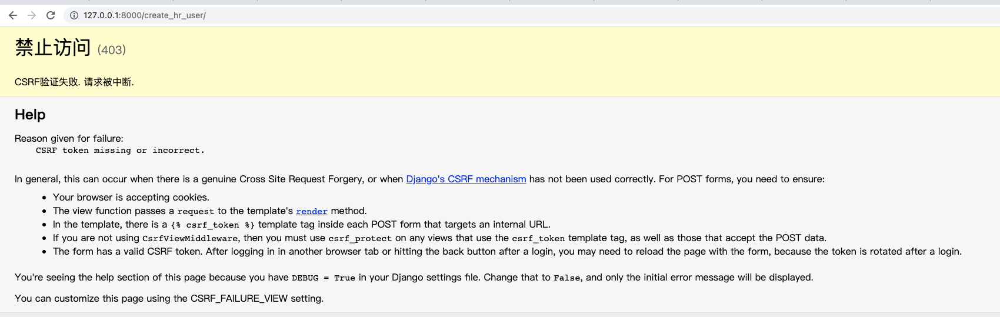  

此时超级管理员访问也会报没有token，这时需要在页面中加上，折这样在视图中渲染模版时调用render方法，此方法带有request context,
request context把csrf_token服务端产生的token吐到客户端的html的页面上，然后用户在浏览器里去提交请求的时候会自动把token带回来给服务端，服务端收到
token回去校验。如果校验通过是服务端产生的，那么认为这个请求是合法安全的，就会继续处理  
***
***
***
# SQL注入攻击
* SQL注入漏洞：攻击者直接对网站数据库执行任意SQL语句，在无需用户权限的情况下即可实现对数据的访问、修改甚至删除
* Django的ORM系统自动规避了SQL注入攻击
* 原始SQL语句，切记避免拼接字符串，这是错误的调用方式  
```sql
query = 'SELECT * FROM employee where last_name = %s' % name 
Person.objects.raw(query)
```
* 正确的调用方式，使用参数绑定
```python
name_map = {'first':'first_name', 'last':'last_name', 'bd':'birth_date', 'pk':'id'}
Person.objects.raw('select * from employee', translations=name_map)

```
***
***
***
# Django Rest framework开发API
参考官网：https://www.django-rest-framework.org/  
大致步骤：  
1. 安装djangorestframework、markdown、filter
2. settings中添加"rest_framework"到app
3. REST框架在settings中配置,指定鉴权的方式是用DjangoModel自带的鉴权方式或者匿名用户的只读访问
4. urls.py中定义实体序列化的方式，指定序列化返回哪些字段，然后再定义ViewSet视图的集合，展示哪些数据，最后把视图的集合注册到api列表里面
5. 添加API访问的根路径以及rest api管理后台里面的登录和退出的url路径前缀

到此配置成功  
访问http://127.0.0.1:8000/api  
>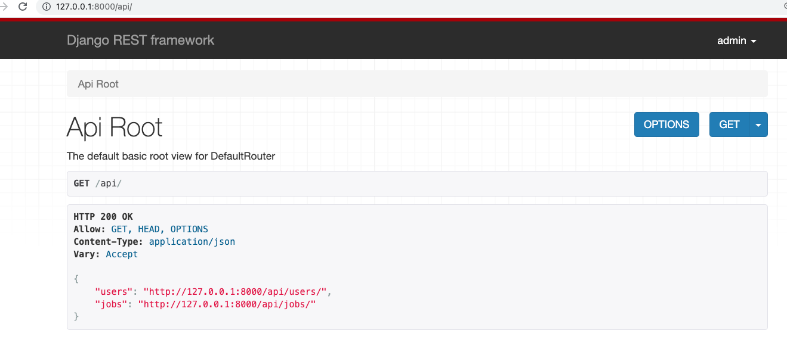

***
***
***

# Redis缓存（需要先安装Django-redis包）
参考官网：https://django-redis-chs.readthedocs.io/zh_CN/latest/  
***缓存的策略***  
* 整站缓存
* 视图缓存
* 模板片段缓存

启动redis服务：redis-server  
>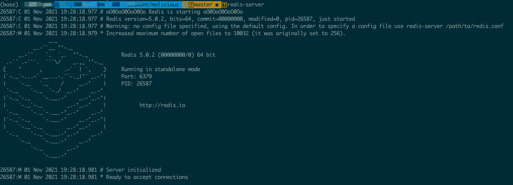 
 
***步骤***
1. settings中缓存设置  
2. 设置整站缓存，在settings文件中间件配置中添加中间件  

此时访问页面,查看response headers看缓存配置是否生效  
>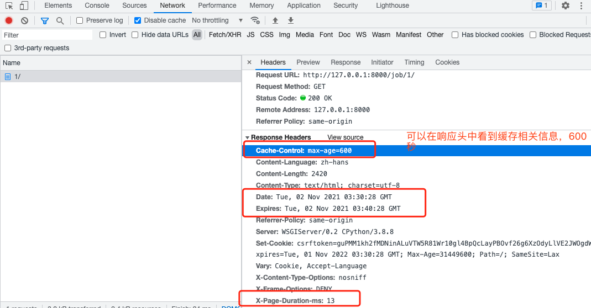  

***测试***：  
在访问数据库的代码中增加日志，在没有命中缓存的时候，这个日志会打印出来，会访问数据库。否则日志不会打印，缓存机制生效

***
***
***
# Celery的使用
参考文档：https://docs.celeryproject.org/en/stable/getting-started/first-steps-with-celery.html#first-steps  
* 一个分布式的任务队列
* 简单：几行代码可以创建一个简单的celery任务
* 高可用：工作机会自动重试
* 快速：可以执行一分钟上百万的任务
* 灵活：每一块都可以扩展

运行celery服务器  
```
cd celery
$ celery -A tasks worker --loglevel=INFO
```
>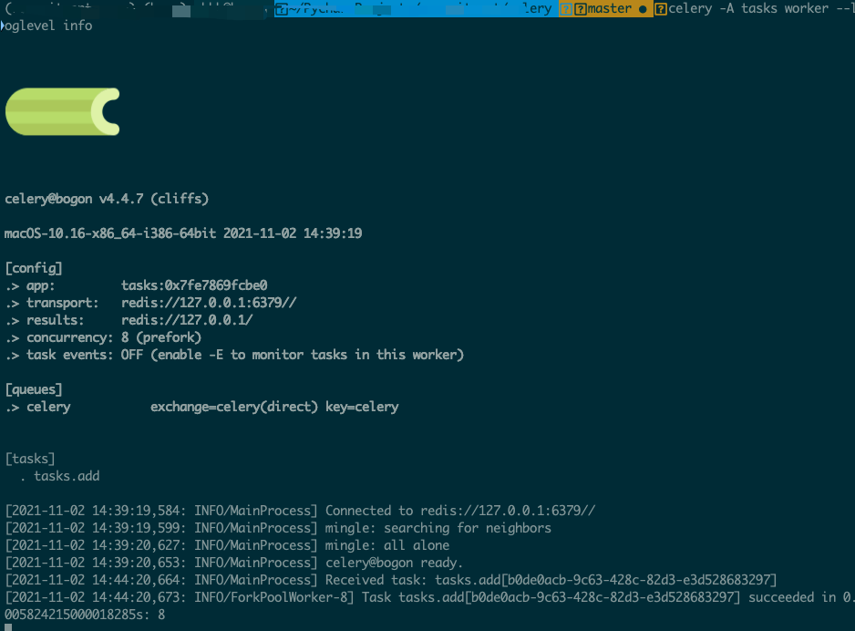   
#### Flower:一个实时的celery任务监控系统
参照文档：https://docs.celeryproject.org/en/stable/userguide/monitoring.html  
启动flower:  
```
celery -A tasks flower --broker=redis://127.0.0.1:6379/0
```
>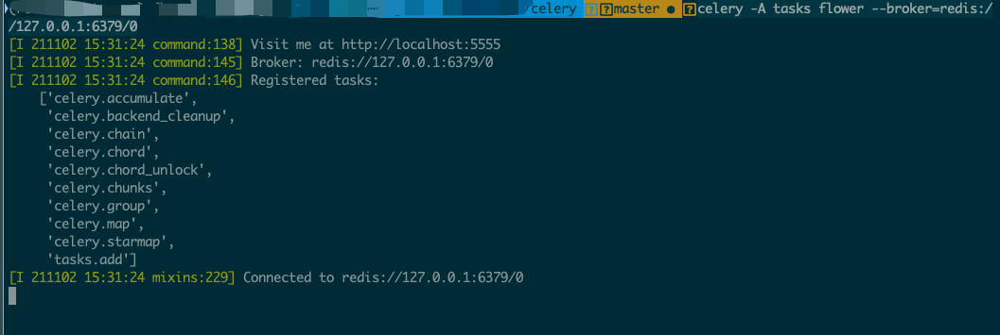 

访问：127.0.0.1:5555  
>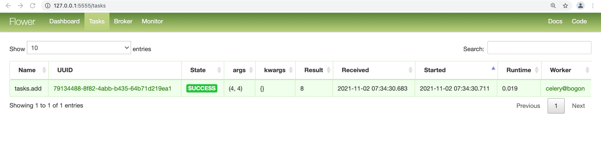 

***
***
***
# django与celery集成
参考文档：https://docs.celeryproject.org/en/latest/django/first-steps-with-django.html

通知面试官，发送钉钉消息改为异步任务  
>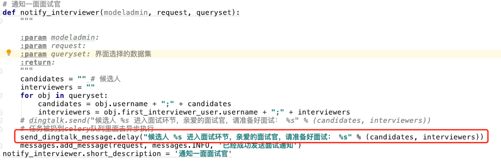 

启动celery  
```
cd 根目录
DJANGO_SETTINGS_MODULE=settings.local celery -A recruitment worker --loglevel=info
由于celery配置使用的settings里面的本地的配置，所以前面加个DJANGO_SETTINGS_MODULE的环境变量
```
>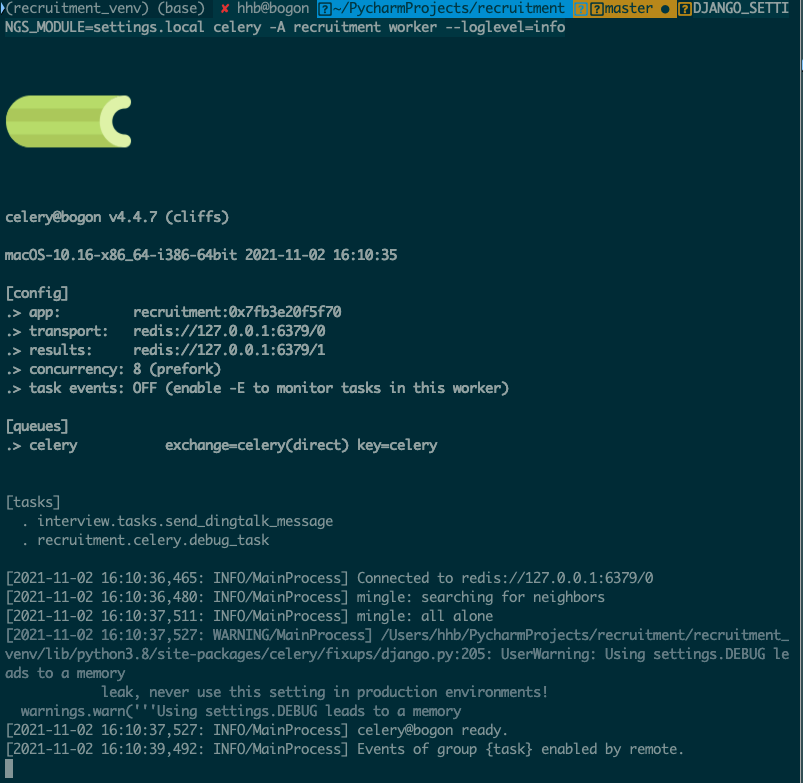   
上图可以看出使用redis作为消息存储也作为结果存储  

启动flower  
```
DJANGO_SETTINGS_MODULE=settings.local celery -A recruitment flower --brokwer=redis://127.0.0.1:6379/0
```

***整个架构***  
前面是从我们的用户侧发送请求到Django  
然后Django产生的任务，把这个任务发给celery  
celery实际上是有它的消息队列，有代理broker,去接受到这个任务把它存起来，  
存起来之后，它的worker celery的worker会去检索队列里面的任务，把这个任务一个个执行  
执行完之后存下来，在我们系统里面可以知道执行结果，也能过通过flower监控到任务的状态  
>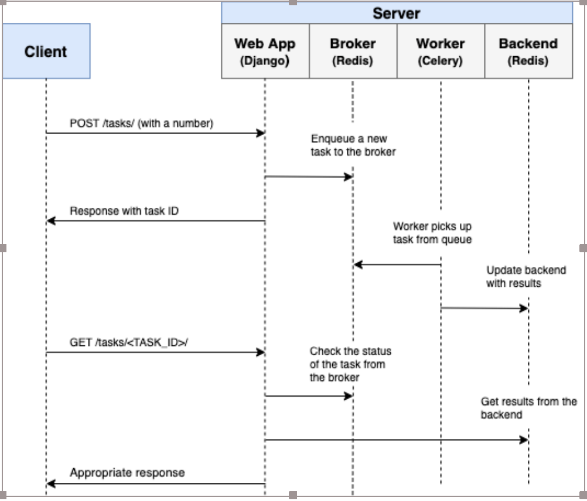   

